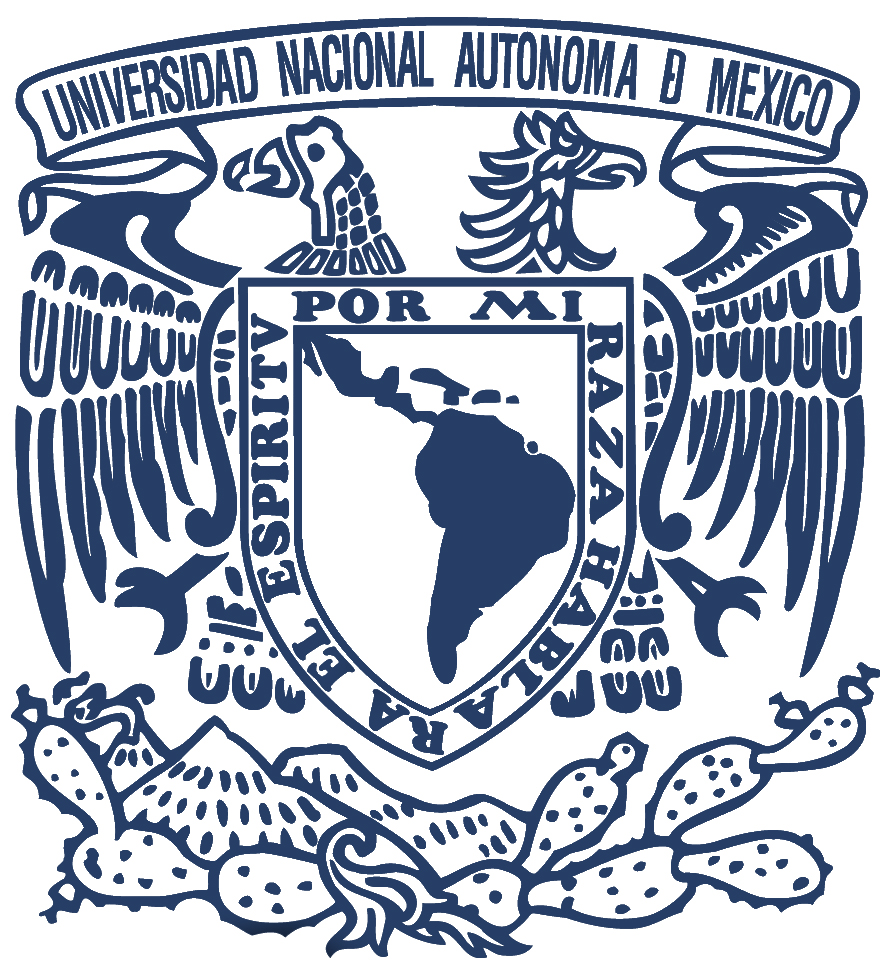

 
## Bio

I am a Ph.D. candidate in [Alejandra Medina-Rivera](http://liigh.unam.mx/profile/dra-alejandra-medina-rivera/)'s lab, the [Regulatory Genomics and Bioinformatics Laboratory](http://liigh.unam.mx/amedina/) at International Laboratory for Human Genome Research ([LIIGH](http://liigh.unam.mx/)) from the National Autonomous University of Mexico ([UNAM](https://www.unam.mx/)). Our goal is to integrate public microarray and RNA-seq data, together with samples manually curated of lung diseases, such as Chronic Obstructive Pulmonary Disease (COPD) and Idiopatic Pulmonary Fibrosis (IPF) for better characterization of gene expression signatures. We work in close colaboration with [Julio Collado-Vides](http://www.ccg.unam.mx/pedro-julio-collado-vides/), [Moises Selman](https://es.wikipedia.org/wiki/Mois%C3%A9s_Selman) and [Yalbi I. Balderas-Martínez](https://scholar.google.com.mx/citations?user=2hvieWAAAAAJ&hl=es).

---

## Education


- `r fontawesome::fa("graduation-cap", fill = "steelblue")` [__Ph.D. candidate in	Biomedical Sciences__](http://www.pdcb.unam.mx/), *current* |  National University of Mexico ([UNAM](https://www.unam.mx/))

- `r fontawesome::fa("graduation-cap", fill = "steelblue")` [__Master of Science in cell biology__](https://www.cell.cinvestav.mx/depto.php?lang=es&tit=1), *2016* | Centro de Investigaciones y Estudios Avanzados del IPN ([CINVESTAV](https://www.cinvestav.mx/))

- `r fontawesome::fa("graduation-cap", fill = "steelblue")` [__Bachelor in Biochemical Engineering__](https://www.encb.ipn.mx/licenciatura/ingenieriaBioquimica/index.html), *2012* | National Biological Science School ([ENCB](https://www.encb.ipn.mx/Paginas/index.html)), [IPN](https://www.ipn.mx/)


---

## Projects

- `r fontawesome::fa("archive",18, fill = "grey")` [PulmonDB](https://pulmondb.liigh.unam.mx/) 

We created [PulmonDB, a gene expression lung diseases database](https://www.nature.com/articles/s41598-019-56339-5), created with public transcriptomic high-throuput data and manual curation information with an online interface for a quick accessibility. 


- `r fontawesome::fa("archive",18, fill = "grey")` Gene expression profile in COPD patients

Using PulmonDB we are analysing gene expression profiles in COPD patients to understand better the disease. 


### 	Past Projects


- `r fontawesome::fa("archive",18, fill = "grey")` [Alternative Splicing in TCDD exposure.](
https://doi.org/10.1371/journal.pone.0219747) | `r fontawesome::fa("thumbtack", fill = "grey")` [Guillermo Elizondo-Azuela's lab](https://www.cell.cinvestav.mx/depto.php?lang=es&tit=4&subt=1&subsubt=6) and [Paul Boutros' lab](https://labs.oicr.on.ca/boutros-lab/software)

My project aim was to unscramble the alternative splicing effects of TCDD in C57BL6 mouse hepatocytes using high-throughput data.


- `r fontawesome::fa("archive",18, fill = "grey")` IGFBP2 in hepatocarcinogenesis. | `r fontawesome::fa("thumbtack", fill = "grey")` [Saúl Villa-Treviño's lab](https://www.cell.cinvestav.mx/depto.php?lang=es&tit=4&subt=1&subsubt=11)

I characterized the protein expression of Insulin-Like Growth Factor Binding Protein II (IGFBP2) during the develompent of cancer in rat livers using blood and tissue.


---


## 	Internships

- [__Dana-Farber Cancer Institute__](https://www.dana-farber.org/) | Department of Data Sciences, [Rafael A Irizarry Laboratory](https://www.dana-farber.org/find-a-doctor/rafael-a-irizarry/) | `r fontawesome::fa("calendar", fill = "grey")` *Nov 2019 – Jan 2020*	|	 [`r fontawesome::fa("thumbtack", fill = "grey")` Boston, USA](https://goo.gl/maps/vrfnSmsPkGKwM6a29)

PulmonDB data analysis.

- [__Fundazione Edmund Mach__](https://www.fmach.it/) | Department of Bioinformatics, Marco Moretto | `r fontawesome::fa("calendar", fill = "grey")` *Sep 2017 – Dic 2017*	| [`r fontawesome::fa("thumbtack", fill = "grey")` Trento, Italy](https://goo.gl/maps/Hkd3gqxngS92)

Set non-public resource to build compendia in Mexico.

  

- [__Ontario Institute for Cancer Research__](https://oicr.on.ca/) | Paul C. Boutros' Laboratory | `r fontawesome::fa("calendar", fill = "grey")`*Sep 2014 – May 2016* | [`r fontawesome::fa("thumbtack", fill = "grey")` Toronto, Canada](https://goo.gl/maps/JcXhPdafWg72)

Explored exon microarrays of mouse liver to characterize alternative splicing events under TCDD exposure. 


- [__Vancouver Prostate Center__](https://www.prostatecentre.com/)  |  Michael Cox's Laboratory | `r fontawesome::fa("calendar", fill = "grey")` *Jun 2010 – Ago 2010* | [`r fontawesome::fa("thumbtack", fill = "grey")` Vancouver, Canada](https://goo.gl/maps/9CuRJuufCQk)  

 Analyzed cell growth, viability, and metastasis by transfectin postate cell lines to uncover potential prostate cancer driver genes.


---

## 	Seminars, conferences and workshops


- WGCAC Next Generation Sequencing Bioinformatics Chile 2019
 Workshop attendee | `r fontawesome::fa("calendar", fill = "grey")` *2019*	| `r fontawesome::fa("thumbtack", fill = "grey")`  Santiago, Chile


- Statistical and Computational Challenges in High-Throughput Genomics with Application to Precision Medicine
Talk | `r fontawesome::fa("calendar", fill = "grey")` *2018*	| `r fontawesome::fa("thumbtack", fill = "grey")`  Oaxaca, Mexico


- American Thoracic Society 2018, International Conference
Poster | `r fontawesome::fa("calendar", fill = "grey")` *2018*	| `r fontawesome::fa("thumbtack", fill = "grey")`  San Diego, CA

  

- International Workshops on Bioinformatics-PYTHON
Workshop attendee | `r fontawesome::fa("calendar", fill = "grey")` *2017*	| `r fontawesome::fa("thumbtack", fill = "grey")`  CCG, UNAM

---

## Teaching

- [Ecology/R Workshop in DataCarpentry](https://map0logo.github.io/2018-08-15-puerto-rico-ecology/) | Instructor 2018 | `r fontawesome::fa("university", fill = "grey")`  Universidad de Puerto Rico | `r fontawesome::fa("calendar", fill = "grey")` *2017*	| `r fontawesome::fa("thumbtack", fill = "grey")`  Puerto Rico, San Juan

- International Workshops on Bioinformatics-GALAXY
Teacher Assistant | `r fontawesome::fa("university", fill = "grey")`  Universidad Nacional Autonoma de México | `r fontawesome::fa("calendar", fill = "grey")` *2017*	|  `r fontawesome::fa("thumbtack", fill = "grey")`  México, CCG


---

## Honors and awards

- Ph.D. Scholarship | Consejo Nacional de Ciencia y Tecnología (CONACYT, Mexico). | `r fontawesome::fa("calendar", fill = "grey")` *2017 - current*
 
- Graduate Student Mobility Scholarship (BECA MIXTA)  | Consejo Nacional de Ciencia y Tecnología (CONACYT, Mexico). | `r fontawesome::fa("calendar", fill = "grey")` *2017*	
 

- Master's Scholarship | Consejo Nacional de Ciencia y Tecnología (CONACYT, Mexico).| `r fontawesome::fa("calendar", fill = "grey")` *2013 - 2015*	
 

- Graduate Student Mobility Scholarship (BECA MIXTA)  | Consejo Nacional de Ciencia y Tecnología (CONACYT, Mexico).| `r fontawesome::fa("calendar", fill = "grey")` *2014-2015*	


- Summer Scholarship   | CINVESTAV | `r fontawesome::fa("calendar", fill = "grey")` *2013*	


- Undergraduate Student Mobility Award | CINVESTAV | `r fontawesome::fa("calendar", fill = "grey")` *2011*	


- Undergraduate Scholarship   | IPN | `r fontawesome::fa("calendar", fill = "grey")` *2007-2011*	


---

## Publications

```{r echo=FALSE, message=FALSE, warning=FALSE}
library(dplyr)
 scholar::get_publications("G6q6rP0AAAAJ")%>% 
   filter(!is.na(cid)) %>% 
   distinct(title, .keep_all = TRUE) %>%
   mutate_all(funs(stringr::str_replace(., "_", " "))) %>%
   arrange(desc(year)) %>%
   transmute(bibtype = "Article", author = as.character(author),
             title = as.character(title),
             journaltitle = as.character(journal), year, key = dplyr::row_number()) %>% 
   RefManageR::as.BibEntry() %>% 
   RefManageR::WriteBib("abva.bib")

ls <-  vitae::bibliography_entries("abva.bib") %>% 
  select(author,title, issued, `container-title`)

colnames(ls) <-  c("Authors", "Title", "Year", "Journal")

knitr::kable(ls, format = "html", booktabs = TRUE) %>% 
  kableExtra::kable_styling(font_size = 11) %>% 
  kableExtra::row_spec(0, bold = TRUE, italic = TRUE, color = 'white', background = 'black')

```

<center>
{width=10%} {width=10%} {width=10%}
